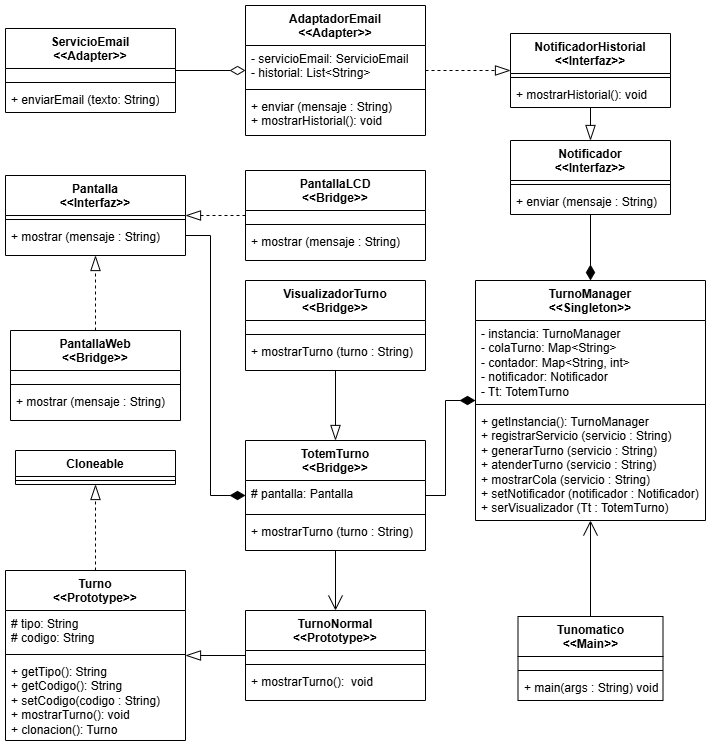

# Sistema-Tunomatico

## ✅ Descripción General del Sistema
este proyecto consiste de un Sistema Completo de Gestion de **Turnos Digitales** (Tunomático), realizado siguiendo las buenas practicas de diseño orientado a objetos, aplicando 4 patrones de diseño (Singleton, Prototype, Bridge y Adapter) para la **Generacion, Registro, Visualización y Toma de Turnos** desde un Totem para practicamene cualquier entorno comercial de gran concurrencia}

---

## 🔍 Objetivos del Modelado
- Demostrar la transición completa desde la visión funcional (casos de uso) hasta la arquitectura física (implementación).
- Reflejar tanto el diseño lógico (diagrama de clases con patrones aplicados) como la distribución en nodos y componentes reales (diagrama de implementación UML).
- Desarrollar mi visión profesional del modelado arquitectónico.
- Comprender la importancia de la trazabilidad entre visión funcional, lógica y física.
- Acostumbrarme a estándares de documentación de alto nivel, y modelar como lo haría un arquitecto senior en la industria real.

## 🔹 1. Diagrama de Casos de Uso UML

### Descripción general
El análisis funcional permitió identificar con claridad los actores involucrados y las funcionalidades críticas del sistema. Además, se aplicaron correctamente **relaciones de `<<include>>` y `<<extend>>`** para reflejar flujos obligatorios y opcionales en el proceso.
#### Actores identificados:
- **Cliente**: el usuario que solicita un turno al totem para ser atendido.
- **Totem**: la maquina que genera turnos, provee una boleta impresa, muestra la cola de turnos en su pantalla y su caja respectiva.
- **Empleado**: aquel encargado de atender al cliente en el servicio que quiere/necesita.
- **Administrador**: quien se encarga de configurar el totem y sus registros, y disponer nuevas cajas disponibles para que el totem pueda dirigir un turno hacia esta.

#### Casos de uso destacados y relaciones aplicadas:
- **Solicitud y Generacion**:
  - `<<include>>` **Generar Turno**: el totem genera un turno a peticion del Cliente
- **Notificacion al Sistema**:
  - `<<include>>` **Enviar Notificacion**: el totem y el empleado generan una notificacion al sistema una vez que cumplen con sus funciones respectivas. esto para que la empresa/negocio/entorno comercial tenga el registro de las atenciones realizadas para usarlas como les convenga.
- **Configurar medio de Notificacion**:
  - `<<extend>>` **configurar salida de la Notificacion**: el administrador puede configurar en el sistema el medio por el cual sera recibida la notficacion de los servicios, de modo que puedan recibirlo mediante Email, SMS o el medio que estimen conveniente.

#### Justificación de las relaciones aplicadas:
- Se utilizaron `<<include>>` en procesos donde el caso de uso base **siempre depende de otro caso obligatorio**, como en **Generar Turno** y **Atender Turno** donde si o si deben enviar una notificacion de atencion para el registro, o como en **Solicitar Turno** donde la maquina siempre le generara un vale/boleta al cliente independiente de si va a ser atendido o no.
- Se utilizo el `<<exclude>>` en procesos donde las acciones son **condicionadas o opcionales**, como **Configurar salida de Notificaciones** donde el Administrador tiene la alternativa de configurar el medio de salida de las notificaciones despues de ver el historial de notificaciones/mensajes enviadas al registro.

## 🔹 2. Diagrama de Clases UML con Patrones Aplicados

## 🧩 Justificación Arquitectónica y Patrones Aplicados

### Selección de patrones
La elección de los patrones de diseño no fue arbitraria, sino estratégica y alineada a las necesidades específicas del sistema y sus desafíos técnicos:

### **1. Singleton (`ConfiguracionSistema`)**
#### Justificación:
Se seleccionó Singleton para la **gestión centralizada de parámetros críticos del sistema**, como tiempos de vencimiento, stock mínimo, tipos de alerta, entre otros.  
Este patrón permite garantizar que **exista una única instancia accesible globalmente**, evitando inconsistencias y facilitando la administración de la configuración desde cualquier módulo del sistema.

