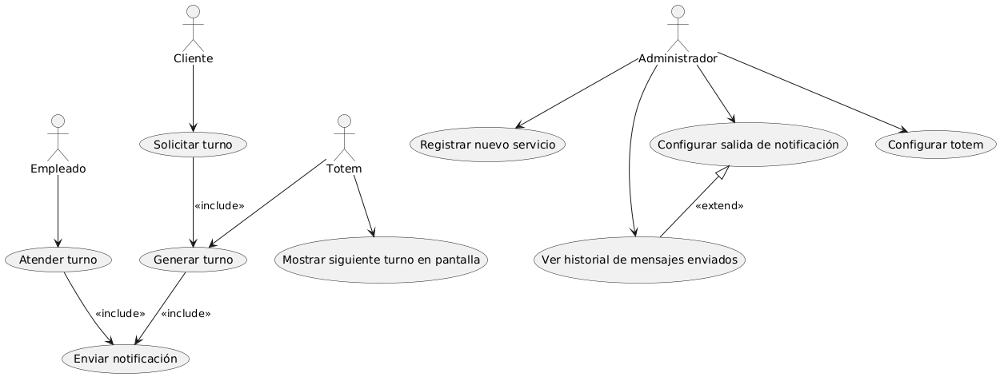
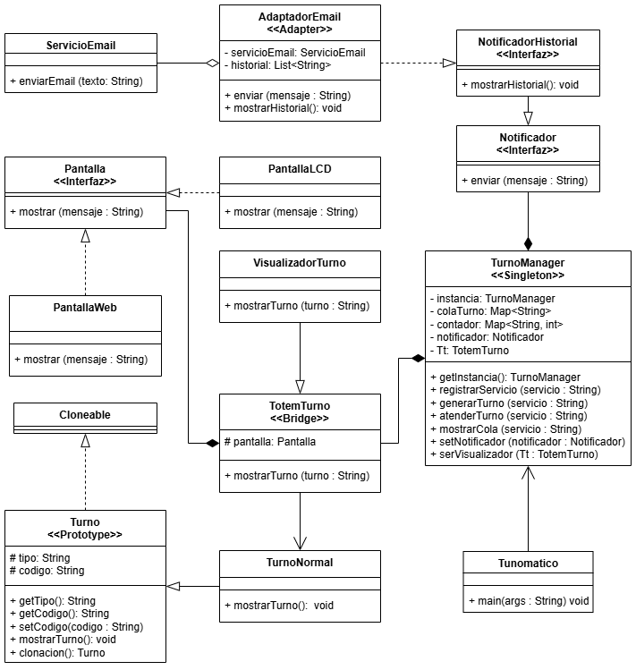
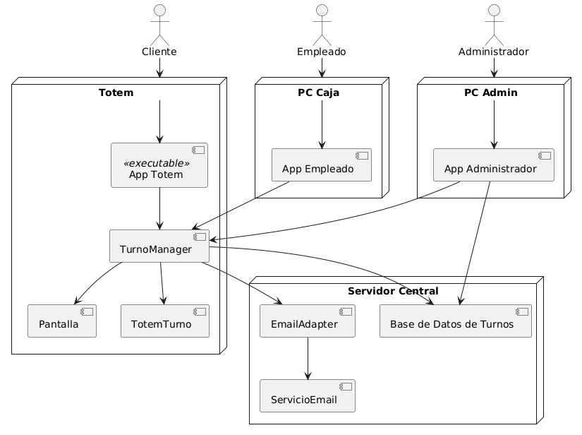

# Sistema-Tunomatico

## ✅ Descripción General del Sistema
este proyecto consiste de un Sistema Completo de Gestion de **Turnos Digitales** (Tunomático), realizado siguiendo las buenas practicas de diseño orientado a objetos, aplicando 4 patrones de diseño (Singleton, Prototype, Bridge y Adapter) para la **Generacion, Registro, Visualización y Toma de Turnos** desde un Totem para practicamene cualquier entorno comercial de gran concurrencia}

---

## 🔍 Objetivos del Modelado
- Demostrar la transición completa desde la visión funcional (casos de uso) hasta la arquitectura física (implementación).
- Reflejar tanto el diseño lógico (diagrama de clases con patrones aplicados) como la distribución en nodos y componentes reales (diagrama de implementación UML).
- Desarrollar mi visión profesional del modelado arquitectónico.
- Comprender la importancia de la trazabilidad entre visión funcional, lógica y física.
- Acostumbrarme a estándares de documentación de alto nivel, y modelar como lo haría un arquitecto senior en la industria real.

## 🔹 1. Diagrama de Casos de Uso UML

### Descripción general
El análisis funcional permitió identificar con claridad los actores involucrados y las funcionalidades críticas del sistema. Además, se aplicaron correctamente **relaciones de `<<include>>` y `<<extend>>`** para reflejar flujos obligatorios y opcionales en el proceso.
#### Actores identificados:
- **Cliente**: el usuario que solicita un turno al totem para ser atendido.
- **Totem**: la maquina que genera turnos, provee una boleta impresa, muestra la cola de turnos en su pantalla y su caja respectiva.
- **Empleado**: aquel encargado de atender al cliente en el servicio que quiere/necesita.
- **Administrador**: quien se encarga de configurar el totem y sus registros, y disponer nuevas cajas disponibles para que el totem pueda dirigir un turno hacia esta.

#### Casos de uso destacados y relaciones aplicadas:
- **Solicitud y Generacion**:
  - `<<include>>` **Generar Turno**: el totem genera un turno a peticion del Cliente
- **Notificacion al Sistema**:
  - `<<include>>` **Enviar Notificacion**: el totem y el empleado generan una notificacion al sistema una vez que cumplen con sus funciones respectivas. esto para que la empresa/negocio/entorno comercial tenga el registro de las atenciones realizadas para usarlas como les convenga.
- **Configurar medio de Notificacion**:
  - `<<extend>>` **configurar salida de la Notificacion**: el administrador puede configurar en el sistema el medio por el cual sera recibida la notficacion de los servicios, de modo que puedan recibirlo mediante Email, SMS o el medio que estimen conveniente.

#### Justificación de las relaciones aplicadas:
- Se utilizaron `<<include>>` en procesos donde el caso de uso base **siempre depende de otro caso obligatorio**, como en **Generar Turno** y **Atender Turno** donde si o si deben enviar una notificacion de atencion para el registro, o como en **Solicitar Turno** donde la maquina siempre le generara un vale/boleta al cliente independiente de si va a ser atendido o no.
- Se utilizo el `<<exclude>>` en procesos donde las acciones son **condicionadas o opcionales**, como **Configurar salida de Notificaciones** donde el Administrador tiene la alternativa de configurar el medio de salida de las notificaciones despues de ver el historial de notificaciones/mensajes enviadas al registro.

## 🔹 2. Diagrama de Clases UML con Patrones Aplicados

## 🧩 Justificación Arquitectónica y Patrones Aplicados

### Selección de patrones
La elección de los patrones de diseño no fue arbitraria, sino estratégica y alineada a las necesidades específicas del sistema y sus desafíos técnicos:

### **1. Singleton (`TurnoManager`)**
#### Justificación:
Se seleccionó Singleton para la **gestión centralizada de parámetros críticos del sistema** como la única instancia central que controla la lógica de turnos (crear, atender, almacenar), permitiendo un acceso global y control unificado sobre la gestión de turnos, evitando duplicaciones.
Este patrón permite garantizar que **exista una única instancia accesible globalmente**, evitando inconsistencias y facilitando la administración de la configuración desde cualquier módulo del sistema.

#### Intención arquitectónica:
- Centralizar el control de la configuración.
- Facilitar la escalabilidad futura permitiendo la consulta distribuida.
- Evitar múltiples puntos de configuración que pudieran provocar errores operacionales.

---

### **2. Prototype (`Turno`)**
#### Justificación:
Se implementó Prototype para **permitir la clonación de plantillas de movimientos frecuentes**, como vendria a ser la funcion y uso de los turnos en un servicio requiere que posean caracteristicas similares siendo objetos independientes producidos constantemente, clonando una instancia base (TurnoNormal) para generar nuevas copias sin tener que crear cada una desde cero.

#### Intención arquitectónica:
- Reducir la complejidad y tiempo de operaciones manuales.
- Permitir la creación rápida de nuevas instancias de movimientos desde plantillas base, manteniendo flexibilidad y control.
- Mejorar el rendimiento automatizando configuraciones repetitivas.

---

### **3. Adapter (`AdaptadorEmail`)**
#### Justificación:
Dado que el sistema necesita comunicarse con un servicio externo de email (ServicioEmail) cuya interfaz no es compatible directamente con la del sistema, el uso de Adapter fue clave para adaptar (valga la redundancia) esa clase externa a la interfaz esperada por el sistema (Notificador), permitiendo reutilizar código existente de terceros (como lo es un servicio de correo) sin modificar su lógica interna.

#### Intención arquitectónica:
- Asegurar la independencia tecnológica del sistema interno.
- Facilitar el mantenimiento y evolución del sistema de integración.
- Permitir la adaptación a distintos sistemas externos (Email en este caso) sin impactar el dominio.

---

### **4. Bridge (`TotemTurno`)**
#### Justificación:
Considerando la indefinida cantidad de clientes que usaran este sistema, se aplicó Bridge para **separar la interfaz de usuario de la lógica de negocio**, permitiendo adaptar la experiencia según el perfil del usuario y el dispositivo utilizado, sin afectar la lógica central del sistema, ya que cuenta con distintas interfaces visuales (Web, LCD). Permitiendonos a futuro cambiar o agregar nuevas interfaces visuales sin afectar la lógica del sistema de turnos.

#### Intención arquitectónica:
- Flexibilizar las vistas según necesidades operativas.
- Garantizar independencia entre interfaz y lógica.
- Facilitar futuras integraciones con nuevas plataformas (app, mensajeria, asistente virtual, etc).

---

## 🔹 3. Diagrama de Implementación UML

### Despliegue Físico y decisiones técnicas:
- **Nodos físicos diferenciados** para reforzar seguridad, escalabilidad y disponibilidad.
- Separación clara de responsabilidades entre servidores de aplicaciones, configuración, y bases de datos.
- Aislamiento de componentes críticos (como la `Aplicacion del Administrador`) para reforzar la seguridad y el control de cambios y configuración.

---

## 🧩 Reflexiones Finales del Modelado

Este ejercicio refleja una aproximación arquitectónica profesional donde:
- Cada patrón fue seleccionado según necesidades específicas y no como elemento decorativo.
- La transición entre **caso de uso ➡ diagrama de clases ➡ implementación** permitió mantener una trazabilidad clara desde el negocio hasta la infraestructura.
- La modularización y aplicación de patrones permitieron diseñar un sistema robusto, flexible, mantenible y alineado a buenas prácticas de ingeniería de software.
