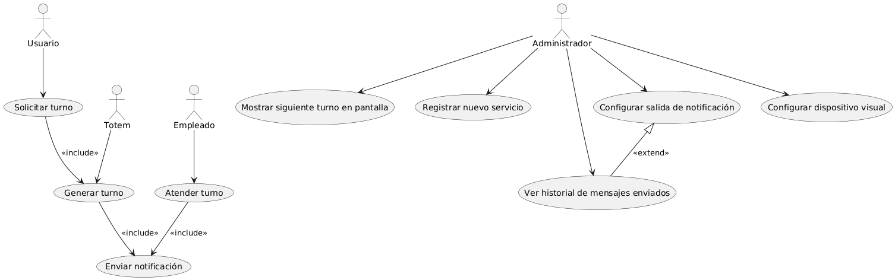

# Sistema-Tunomatico

## ✅ Descripción General del Sistema
este proyecto consiste de un Sistema Completo de Gestion de **Turnos Digitales** (Tunomático), realizado siguiendo las buenas practicas de diseño orientado a objetos, aplicando 4 patrones de diseño (Singleton, Prototype, Bridge y Adapter) para la **Generacion, Registro, Visualización y Toma de Turnos** desde un Totem para practicamene cualquier entorno comercial de gran concurrencia}

---

## 🔍 Objetivos del Modelado
- Demostrar la transición completa desde la visión funcional (casos de uso) hasta la arquitectura física (implementación).
- Reflejar tanto el diseño lógico (diagrama de clases con patrones aplicados) como la distribución en nodos y componentes reales (diagrama de implementación UML).
- Desarrollar mi visión profesional del modelado arquitectónico.
- Comprender la importancia de la trazabilidad entre visión funcional, lógica y física.
- Acostumbrarme a estándares de documentación de alto nivel, y modelar como lo haría un arquitecto senior en la industria real.

## 🔹 1. Diagrama de Casos de Uso UML

### Descripción general
El análisis funcional permitió identificar con claridad los actores involucrados y las funcionalidades críticas del sistema. Además, se aplicaron correctamente **relaciones de `<<include>>` y `<<extend>>`** para reflejar flujos obligatorios y opcionales en el proceso.
#### Actores identificados:
- **Usuario**: la persona que quiere un turno para ser atendido
- **Totem**: la maquina que genera turnos y provee una boleta impresa
- **Empleado**: aquel que atiende al usuario en el servicio que quiere/necesita
- **Administrador**: 
